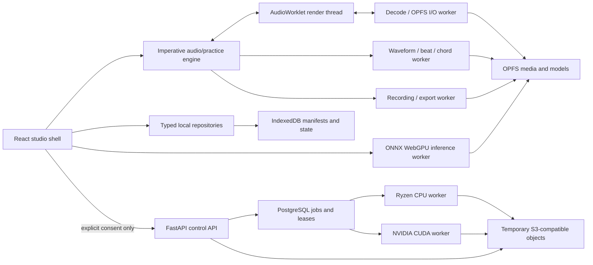

# Atarang Web — decision-complete implementation plan

Status: planning only; no production application code is included.  
Source-of-truth checkout: `/Users/shantanugoel/dev/atarang` at commit `3820c991697e401d65f6c9cbd23612e73879af60` (clean when inspected).  
Target workspace: `/Users/shantanugoel/dev/atarang-web`.  
Research reviewed: 2026-08-10.

## Evidence labels

- **Verified** means observed in the local iOS implementation, its tests, its checked-in evidence, or a linked primary source.
- **Measured** means run during this planning pass. Measurements on the current Apple Silicon development machine are not treated as Linux/CPU/GPU inference results.
- **Decision** is the prescribed implementation choice.
- **Qualification gate** is a deliberately numeric pass/fail check. It is not permission for the implementation agent to substitute another architecture.

## 1. Executive recommendation

Build a desktop-first local-first PWA with a React 19/TypeScript shell, an imperative Web Audio engine, AudioWorklet rendering, dedicated workers for storage/decoding/analysis/recording/inference, IndexedDB for transactional metadata, and OPFS for large media and model files. Use Bun for dependency management, development, production bundling, tests, and build orchestration. Bun is sufficient, but Workers, the AudioWorklet, and the service worker must be explicit build entries and a small Bun build script must generate/inject their hashed URLs. Do not add Vite.

The first separation experience is four-stem `htdemucs`. Offer local inference only after a real on-device WebGPU qualification probe. Keep the rest of Studio fully usable without local ML. When local inference is unsupported, slow, out of memory, or loses its device, offer the explicit cloud route; never upload merely to benchmark and never silently fall back to upload.

Use a Python 3.12 FastAPI control API and separate PyTorch inference workers. Manage every Python interpreter, dependency, tool, and invocation with uv and a committed `uv.lock`. Keep the API CPU-only. Produce distinct CPU and NVIDIA CUDA worker OCI images from the same code and model manifest. A PostgreSQL leased-job table is the v1 queue; do not add Redis. Use an S3-compatible temporary object store for resumable uploads and worker-independent media transfer.

Package the system as OCI images. The concrete v1 production target is Linux on x86-64 Ryzen/NVIDIA, deployed by Docker Compose behind Caddy. The NVIDIA worker uses the NVIDIA Container Toolkit and CUDA; there is no Metal server path. For a stronger boundary, run the unchanged Compose project inside an Incus VM with a physical GPU passed through. Do not build a second native-Incus packaging system in v1.

The largest product risk is YouTube ingestion. YouTube's developer policy prohibits downloading, importing, storing, or separating audiovisual content through API clients without approval. yt-dlp is also operationally fragile because of bot detection, cookie/IP reputation, extractor churn, and format changes. Ship local-file import as first class. Compile the YouTube worker, but keep it disabled by default in public deployments behind an operator flag and legal/terms approval gate. A self-hosting operator who enables it must accept a rights/terms warning; Atarang must not present that as proof of legal permission.

No product account system is required for a private single-operator v1. Operational authentication is still necessary: the deployment has an operator API key for creating compute work, while each job gets a random bearer capability. Public anonymous cloud compute and public YouTube acquisition are out of scope until an abuse-control phase.

## 2. Verified iOS-to-web parity matrix

Classification: **Direct** = product logic/schema ports; **Different** = parity with a web-specific implementation; **Limited** = browser constraint is visible to the user; **Backend** = requires the optional server; **Deferred** = explicitly not in v1.

| Area | Verified iOS behavior and invariant | Web classification | Prescribed web result |
|---|---|---:|---|
| Local ingestion | App Store flavor imports local Files; original metadata is schema-versioned and reproducibility is explicit. | Different | File picker plus drag/drop; stream into OPFS staging, hash while writing, decode-probe, then publish atomically. Preserve the imported compressed original. |
| YouTube ingestion | Sideload flavor has a YouTube workflow; Store flavor does not. Source URL is metadata, not a playback dependency. | Backend | Server-only, feature-flagged, rights-attested URL job. No browser scraper and no hidden upload. Local-file route always remains beside it. |
| Four-stem separation | Bundled `htdemucs` produces vocals/drums/bass/other; output length must equal the song. Only this model has complete checked-in rights evidence. | Different + Backend | Qualified browser ONNX/WebGPU path and CPU/CUDA backend use the same stem kinds and canonical manifest. Exact length is a release gate. |
| Six-stem/alternate models | `htdemucs6s`, MDX23C, and Kim models exist as optional choices, but release evidence and/or quality are incomplete; Demucs itself warns that six-stem piano is weak. | Deferred | Do not expose in v1. Add only after license, quality, memory, and runtime qualification using the same manifest model slot. |
| Atomic separation | iOS writes to a hidden same-volume staging directory, validates audio/metadata/checksums, then renames/replaces. Readers ignore staging and startup sweeps it. | Different | OPFS staging plus hashes/readability checks, followed by one IndexedDB transaction that publishes the committed manifest. The DB, not directory visibility, is the commit point. |
| Synchronized stems | A common source time drives all scheduled audio; tests cover sample rates, restarts, route changes, loops, and exact song length. Checked-in iPhone evidence reports 0.00 ms typical and 0.02 ms worst drift. | Different | One render graph and one source-frame clock in an AudioWorklet. Never create independent HTML media clocks per stem. |
| Mixer | Per-stem gain, mute/solo, target selection, and Learn/Guide/Play Along presets. A missing target is reported rather than silently substituted. | Direct + Different | Port preset/target state and gain rules; render in one audio processor. Disable unavailable targets with a reason. |
| Transport | Persistent transport, waveform, seek, current position, and A–B loop. Loop minimum is 0.5 s. | Different | Worklet/worker generation-token seeks and source-frame loop boundaries; multiresolution cached waveform. Persistent bottom UI in every stage. |
| Speed and pitch | Playback rate and semitone shift are independent and persist independently of saved A/B sections. Live rate changes are tested. | Different | One Signalsmith Stretch WASM processor on the final stereo mix; v1 range 0.5–1.0× and -12…+12 semitones. No chipmunk coupling. |
| Sections | Named practice sections store A/B only; target, mix, speed, and key remain independent. | Direct | Preserve that separation. Selecting a section changes bounds, not the current practice setup. |
| Repetitions/ramps | Repetition count, pauses, and tempo ramps are persisted; bounds include pause 0–10 s, repetitions up to 999, ramp interval up to 99. | Direct + Different | Port controller state machine; render boundaries from the audio clock, not UI timers. |
| Metronome/count-in | BPM 30–300, subdivision/accent/level/alignment, beat-grid following, metronome-only, tap tempo, count-ins 0/2/4. Exact scheduling is tested. | Different | Click/count-in synthesized in AudioWorklet from source time and explicit beat grid. Tap timestamps enter through UI but tempo smoothing lives in the engine. |
| Beat grid | Explicit beat list represents drift; reliability and user-correction are first-class. Unreliable analysis does not snap. Corrected grids survive reanalysis. | Direct + Different | Port schema and semantics. Offline analysis worker performs detection; correction UI edits beats/downbeats. Bar snap is enabled only for reliable or user-edited grids. |
| Lyrics | Manual text/editing, LRC import/export, manual timing, word/line intervals, offset, confidence/source, synced and sing-along display. | Direct + Different | Port schema/parser and source-time semantics; use a virtualized editor and keyboard timing commands. Do not derive timing from stretched output time. |
| Chords | Detection, rich chord parsing, slash bass, key/confidence, correction, transposition, simplification, capo, layout, and correction preservation. | Direct + Different | Port parser/normalization/schema and golden cases. Run chroma/detection offline in analysis worker; generate accessible SVG chord diagrams from curated shapes. |
| User charts | ChordPro and smart-paste import, evidence-based lyric/beat/audio alignment, repeated-lyric handling, independent charts/selections, per-chart corrections. | Direct + Different | Preserve independent chart IDs and correction layers; import/export ChordPro. Never merge user charts into reproducible analysis data. |
| Recording | Separate mic and backing streams, bounded writer queue (~6 s), fail instead of dropping, duration plausibility validation, isolated take exports. | Different + Limited | AudioWorklet timestamps both streams in one context; recording worker drains bounded SAB rings into OPFS staging. Stop safely on device loss/overflow. Browser input latency is calibrated/recorded, not assumed. |
| Export | Recording/export operations are serialized and validated. | Different | Offline worker renders WAV universally; capability-gated M4A/AAC or WebM/Opus through Mediabunny/WebCodecs. Preserve separate dry mic/backing sources and non-destructive trim metadata. |
| Library | Originals, separations, performances, practice state, and analyses are related but independently removable. Downloaded originals/stems are reproducible; performances/state are user data. | Different | IndexedDB relational manifests plus OPFS blobs. Removal UI distinguishes cache/reproducible media from irreplaceable work. |
| Practice persistence | `practice.json` v5 includes stage, target/preset, loop, rate/pitch, count-in, position, metronome, reps/ramp, bar snapping, sections, chord settings/capo, and stem levels. | Direct | Port every field into a versioned `PracticeStateV1` JSON schema; debounce normal edits and force a transaction on stop/page hide. |
| Analysis persistence | Lyrics/chords/beats/user-chords are distinct files. Analysis belongs to Original, not Separation; algorithm mismatch is discarded, not silently migrated. | Direct | Store distinct versioned records keyed by original ID. User edits overlay generated results and survive reanalysis. Unknown algorithm versions are recomputed; user data is migrated explicitly. |
| Queue/cancellation | Analysis is serial, cancellable, and protected by stable token/generation; no analysis starts during recording. | Direct + Different | One per-tab scheduler coordinates analysis/local separation/export; BroadcastChannel lease prevents two tabs mutating one song. Recording preempts analysis. |
| Integrity/recovery | Hidden staging is swept; corrupt artifacts are quarantined; damaged derived JSON reads as missing; storage preflight includes safety headroom. | Different | DB commit marker, startup integrity scan, orphan-staging GC, quarantine table, explicit repair/remove. Quota failure never publishes a partial object. |
| Diagnostics/privacy | Diagnostics omit titles, source URLs, and filenames. | Direct | Use opaque IDs, versions, capability results, timings, and error codes only. Diagnostic export requires preview and explicit save. |
| Background/system behavior | Apple audio session, route handling, lock-screen/background integration, and Core ML/Metal are platform-specific. | Limited | Feature-detect Media Session; recover/pause on suspended AudioContext and device changes. No promise of uninterrupted mobile background playback. No server dependency on Metal. |

### Schemas and algorithms to port conceptually

- Preserve `StemKind`: `vocals | drums | bass | other` in v1; reserve `guitar | piano | instrumental` for later manifests.
- Preserve source-song time. Persist timestamps as integer microseconds (`timeUs`); audio asset descriptors additionally carry exact integer `durationFrames` and `sampleRate`. Never persist floating-point seconds as authoritative.
- Analysis attaches to `originalId`. Separation is a replaceable rendering of that original. User corrections and charts are user data and survive derived-artifact deletion/reanalysis.
- Port the Swift chord grammar, normalization, transposition, simplification, capo, alignment, and golden tests before redesigning the algorithm. Port the explicit beat-grid/correction model and LRC parser/export round trips.
- Port test intent, not Apple frameworks: generation-token cancellation, exact source clock, correction preservation, no target substitution, atomic publish, privacy-redacted diagnostics, bounded recording queues, and storage headroom.
- Implement offline waveform/beat/chord analysis in a dedicated TypeScript worker using typed arrays and a pinned MIT FFT implementation. This is intentionally separate from render-time DSP. If the port cannot process a 10-minute stereo file below 0.5 real-time factor and 512 MiB peak in the qualification corpus, optimize that same worker/WASM boundary; do not move analysis to the UI thread.

### Local source traceability ledger

The implementation agent should read these files before porting each boundary; the matrix above was checked against them rather than inferred from screenshots alone.

| Boundary | Primary iOS source | Regression intent to port |
|---|---|---|
| Ingestion/model/separation | `AtarangCore/AudioIngestion.swift`, `StemSeparator.swift`, `SeparationModel.swift`, `HTDemucs6Separator.swift`, `MDXVocalSeparator.swift`, plus both flavor `ModelAssetStore.swift` files | `AudioIngestionTests`, `SeparationPipelineTests`, `SeparationFailureTests`, `ModelInstallManifestTests` |
| Playback/transport/timing | `StemPlayer.swift`, `PlaybackState.swift`, `AudioTiming.swift`, `TransportBar.swift`, `WaveformOverview.swift`, `PlaybackDiagnostics.swift` | `AudioTimingTests`, `PlaybackStateTests`, `LiveRateChangeTests`, `PlanarAudioWindowTests` |
| Practice/persistence | `PracticeSettings.swift`, `SongStorage.swift`, `AnalysisQueue.swift`, `CancellableWork.swift`, `StageContainer.swift` | `PracticeSettingsTests`, `SongStorageTests`, `AnalysisQueueTests`, `CancellableWorkTests`, `SerialLaneTests` |
| Lyrics | `Lyrics.swift`, `LyricsFormats.swift`, `LyricsStore.swift`, `LyricsEditor.swift`, `LyricsStage.swift`, `SingAlongView.swift` | `LyricsTests` and storage round trips |
| Beats/chords/charts | `BeatAnalysis.swift`, `BeatDetector.swift`, `BeatGrid.swift`, `ChordAnalysis.swift`, `ChordDetector.swift`, `Chords.swift`, `ChordPlayability.swift`, `ChordSheet.swift`, `UserChords.swift` | `BeatGridTests`, `ChordTests`, `ChordPlayabilityTests`, `ChartRoundTripTests`, `UserChordTests` |
| Recording/export | `AudioTapFileWriter.swift`, `RecordingMode.swift`, `RecordingExportCenter.swift`, `RecordingExporter.swift`, `RecordingMixEditor.swift` | `RecordingSafetyTests`, `SerialLaneTests` |
| Atomic library/recovery | `LibraryStaging.swift`, `LibraryIndex.swift`, `LibraryIntegrity.swift`, `StorageCapacity.swift`, `Models.swift` | `LibraryStagingTests`, `LibraryIndexTests`, `LibraryIntegrityTests`, `LibraryMetadataTests`, `StorageCapacityTests` |
| YouTube/flavors/platform | `AtarangGitHub/YouTubeSource.swift`, `BundledYTDLP.swift`, `ImportView.swift`, `AtarangAppStore/StoreImportView.swift`, `NowPlayingController.swift` | Flavor build configuration, release evidence, and explicit web limitation tests |

Also retain the product/release context in `README.md`, `STUDIO_REDESIGN_PLAN.md`, `RELEASE_PLAN.md`, `USER_CHORDs.md`, `ReleaseEvidence/model-rights.md`, `ReleaseEvidence/privacy-and-network.md`, and the App Store/GitHub third-party-license files. Paths are relative to `/Users/shantanugoel/dev/atarang`; do not mutate that repository during the web implementation.

## 3. Chosen stack, evidence, and rejected alternatives

### Frontend

| Concern | Choice | Reason and boundary |
|---|---|---|
| UI | React 19 + TypeScript strict mode | Mature accessibility/testing ecosystem and `useSyncExternalStore` for imperative engine snapshots. Audio state is not rendered through component state at audio rate. |
| Routing | React Router 7 in library/data mode | Three stable top-level routes (`/studio/:songId?`, `/library`, `/settings`) plus route-level lazy splitting; no server-rendering requirement. |
| UI state | Zustand vanilla stores | Small external stores for shell, selection, dialogs, and low-frequency engine snapshots. Persisted song data remains in repositories, not Zustand middleware. |
| Async workflows | Typed discriminated-union controllers | Job/recording/import states are explicit reducers with exhaustive transitions. Do not add XState until a measured maintenance problem warrants it. |
| Accessibility | React Aria Components | Keyboard/focus/overlay/slider primitives while retaining full visual control. Native elements remain the first choice. |
| Styling | CSS Modules + CSS custom-property design tokens | No runtime CSS cost and no utility-class dependency. Self-host fonts; use system fallback. Icons are Phosphor SVG plus domain-specific custom SVG. |
| Validation/contracts | JSON Schema 2020-12 + Ajv; OpenAPI-generated TypeScript types | Canonical persisted documents are language-neutral. Generate API types from FastAPI's committed OpenAPI snapshot with `openapi-typescript`; CI fails on an uncommitted diff. |
| Large data | `idb` wrapper + OPFS | `idb` exposes real IndexedDB transactions without an ORM. OPFS supplies file-like worker access for large data. |
| Media | Mediabunny + WebCodecs, with a built-in WAV reader/writer fallback | Streaming demux/decode/encode and OPFS sources/sinks without shipping FFmpeg to every browser. Runtime capability probe selects codecs. |
| Time/pitch | Signalsmith Stretch WebAssembly/AudioWorklet | MIT, maintained, independent time/pitch, documented latency/flush/seek. One instance operates on the mixed stereo result. |
| Local inference | ONNX Runtime Web + audited split `htdemucs-web-onnx` export | WebGPU path only after qualification; WebAssembly is a slow fallback probe, not an advertised universal solution. |
| Unit/component tests | Bun test + Testing Library + happy-dom | Bun's Jest-like runner covers TypeScript and supports coverage/JUnit; happy-dom is sufficient for components, not audio correctness. |
| Browser tests | Playwright | Chromium, Firefox, and WebKit projects; real Chrome/Edge stable jobs for WebGPU/media capability. |

### Bun decision

**Measured:** Bun 1.3.14 successfully built a disposable HTML/TypeScript/CSS entry with minification, splitting, hashed assets, and external source maps. It also built Worker, AudioWorklet, and service-worker modules when they were passed as explicit entries. It did **not** discover/rewrite `new URL("./worker.ts", import.meta.url)` or emit those runtime entries automatically.

| Requirement | Bun result | Implementation prescription |
|---|---|---|
| Dev server/HMR | Meets | `Bun.serve` full-stack dev server with HTML entry and HMR. API calls proxy to local FastAPI; dev server sends COOP/COEP. |
| Production bundle | Meets | Bun JS API build, minify, target browser, split route chunks, external source maps uploaded privately to error tooling. |
| Asset hashes/splitting | Meets | Content-hashed naming for app and runtime entries. |
| Workers/AudioWorklet | Meets with explicit wiring | Build every runtime as an explicit ESM entry, collect `BuildArtifact.path/hash`, and generate `src/generated/runtime-assets.ts` before the app build. Never reference `.ts` URLs at runtime. |
| WASM/models | Meets | Copy hashed WASM glue/binaries through the build script. Models are separately versioned downloads, not JS bundle assets. |
| Service worker/manifest | Meets with manual step | Explicit service-worker entry plus generated precache list; checked-in web manifest. No PWA plugin required. |
| CSS | Meets | CSS imports, CSS Modules, minification, and asset URLs. PostCSS is unnecessary in v1; target modern browsers. |
| Tests | Meets | Bun test for unit/component; Playwright is separately invoked by Bun scripts. |
| Type checking | Not provided by bundler | Install TypeScript with Bun and require `bunx tsc --noEmit`; bundling success is not type correctness. |
| Source maps | Meets | Hidden/external production maps; do not serve maps publicly. |

Primary evidence: [Bun bundler](https://bun.sh/docs/bundler), [full-stack/HMR](https://bun.sh/docs/bundler/fullstack), [loaders](https://bun.sh/docs/bundler/loaders), and [Bun test](https://bun.sh/docs/test) (reviewed 2026-08-10).

### Backend

- Python 3.12, FastAPI, Uvicorn, Pydantic v2, SQLAlchemy 2, psycopg 3, and Alembic.
- A uv workspace has `packages/contracts`, `services/api`, and `services/worker`; CPU and CUDA are conflicting dependency groups/images so one lock can describe both without installing CUDA in the API. Builds run `uv sync --locked --no-dev --no-editable`; CI runs `uv lock --check`. uv documents exact lock synchronization and Docker layer patterns ([uv locking/syncing](https://docs.astral.sh/uv/concepts/projects/sync/), [uv in Docker](https://docs.astral.sh/uv/guides/integration/docker/), reviewed 2026-08-10).
- PyTorch inference with a pinned maintained Demucs inference fork/commit and official `htdemucs` weight SHA-256. FFmpeg and yt-dlp are subprocess tools in the worker image, each pinned by image/package version and checksum. Do not import an unpinned Git branch.
- PostgreSQL is the durable queue and metadata store. Workers claim rows using `FOR UPDATE SKIP LOCKED`, set a lease/heartbeat, and make progress monotonic. Redis/Celery is rejected for v1 because Postgres already provides durability, cancellation state, idempotency, and recovery at the intended small scale.
- S3-compatible temporary storage (MinIO in the Compose profile) supports multipart upload and future remote GPU workers. All object keys are random IDs, never user filenames. MinIO's license and upgrade notes must be included in the distribution SBOM.
- Server-Sent Events report progress. The workflow is server-to-client and does not justify WebSockets. Polling `GET` remains the recovery/fallback path.

### Rejected choices

- **Vite/PWA plugin:** rejected because Bun meets the identified build requirements with a small auditable manifest script. Reconsider only if Bun cannot emit a required browser target after a filed/minimal reproducer, not for familiarity.
- **Next.js/SSR:** rejected; Studio is an offline-capable client application, and SSR adds a Node-compatible runtime without improving audio/storage.
- **Tailwind/shadcn:** rejected for this bespoke musician workspace and long-lived stateful controls; CSS Modules and accessible headless primitives better preserve the visual hierarchy.
- **HTMLMediaElement per stem:** rejected because independent media clocks cannot meet drift, loop, and time-stretch invariants.
- **Put decoded songs in IndexedDB:** rejected due transaction/memory pressure. IndexedDB contains metadata; OPFS contains streams.
- **Cache API for user media:** rejected; Cache is for the immutable app shell, not editable large binary data.
- **MediaRecorder as the canonical take format:** rejected because codec/timeslice behavior differs by browser and does not prove mic/backing alignment. It may be an optional convenience encoding after validated capture.
- **ffmpeg.wasm in the main product path:** rejected for download size, memory duplication, startup, and threading requirements. Server FFmpeg handles exotic formats; browser import reports unsupported codecs clearly.
- **Rubber Band:** technically strong but GPL/commercial licensing is incompatible with an uncomplicated web distribution. [Rubber Band licensing](https://github.com/breakfastquay/rubberband) was reviewed 2026-08-10. Signalsmith is MIT ([repository](https://github.com/Signalsmith-Audio/signalsmith-stretch), [algorithm/API notes](https://signalsmith-audio.co.uk/code/stretch/)).
- **SoundTouch:** rejected for lower expected quality at polyphonic practice ranges and a less suitable current AudioWorklet/WASM integration.
- **Server JavaScript for inference:** rejected because the maintained Demucs/PyTorch/CUDA ecosystem and reproducible model tooling are Python-native.
- **Celery/Redis/Kubernetes:** rejected for v1 operational cost. PostgreSQL leases and Compose meet one-host requirements; add a scheduler only when measured queue scale demands it.
- **Native services in Incus system containers:** rejected for v1 because it duplicates Compose packaging, complicates CUDA library/driver alignment, and weakens reproducibility. Incus remains a host boundary via VM.

## 4. System architecture and data flow



### Local-file path

1. UI requests a file and creates an `operationId`; the storage worker streams it to `/staging/{operationId}/original`, computes SHA-256, and records bytes without loading the whole file.
2. Media worker probes container/codec/duration and produces canonical 44.1 kHz stereo analysis PCM in bounded chunks. The compressed original remains the reproducible source.
3. Storage preflight accounts for original, worst-case four lossless stems, waveform/analysis, temporary duplicate during commit, plus headroom.
4. Verification passes, then one IndexedDB transaction publishes `OriginalV1` and blob references. Failure removes or quarantines staging; the Library never sees half an import.
5. Separation routing evaluates a cached local capability result. Local inference writes stems under a new staging operation. Cloud creates a consented upload job. Both end by importing the same `SeparationManifestV1` and media variants.
6. Studio opens the manifest; the I/O worker maintains synchronized decoded windows. Only the AudioWorklet advances the authoritative playback cursor.

### YouTube path

1. UI shows policy/reliability warning and asks for a URL; the server feature endpoint must report `enabled` before the form appears.
2. API accepts only a normalized `https://www.youtube.com/watch`, `https://youtu.be/`, or approved YouTube Music form; it creates a capability-scoped job but does not fetch arbitrary URLs.
3. Sandboxed acquisition worker obtains metadata/audio within hard duration/size/time limits, stages it, scans/probes it, and continues through separation. The browser imports the original only if the user chose “keep original”; otherwise it imports stems/manifest and the server deletes its copy on schedule.

## 5. Browser audio and storage architecture

### Storage layout and transactions

Use one IndexedDB database `atarang` with stores `originals`, `separations`, `performances`, `practice`, `lyrics`, `beats`, `chords`, `userCharts`, `blobs`, `operations`, `models`, `capabilities`, `settings`, and `quarantine`. Every record has `schemaVersion`, `createdAt`, and `updatedAt`; user-edit records also have a monotonic `revision`.

OPFS layout:

```text
/blobs/sha256/<first-two>/<digest>       committed content-addressed blobs
/models/<modelArtifactId>/...            verified model pieces
/staging/<operationId>/...               never shown to readers
/exports/<performanceId>/<exportId>/...  user-requested temporary exports
/quarantine/<operationId>/...            broken material awaiting user action
```

- SHA-256 is calculated incrementally in a worker. A blob is deduplicated only after complete hash and byte-length verification.
- Atomic publication is a single IndexedDB transaction that changes `operations.status` to `committed`, inserts manifests, and increments blob reference counts. Moving staged bytes into a content-addressed final path happens before this transaction; an unreferenced final blob is harmless and swept later.
- Startup scans incomplete operations older than five minutes, validates committed blob references in bounded batches, reclaims unreferenced derived blobs, and quarantines inconsistent user blobs. It never deletes a performance/user chart automatically.
- Derived analysis with an unknown `algorithmVersion` is ignored and scheduled for recomputation. User-state schemas use explicit ordered migrations with fixture tests; never “best effort” unknown fields away.
- Request `navigator.storage.persist()` after the first meaningful import, not on first page view. Display whether persistence was granted. OPFS is quota-bound and site data can be evicted; persistent storage reduces but does not replace backup. MDN's current OPFS/quota behavior is documented in [OPFS](https://developer.mozilla.org/en-US/docs/Web/API/File_System_API/Origin_private_file_system), [storage quotas/eviction](https://developer.mozilla.org/en-US/docs/Web/API/Storage_API/Storage_quotas_and_eviction_criteria), and [StorageManager](https://developer.mozilla.org/en-US/docs/Web/API/StorageManager) (reviewed 2026-08-10).
- Preflight requires `estimatedAdditionalBytes + max(1 GiB, 20% of estimatedAdditionalBytes)` to be less than the available estimate. If the browser does not provide a useful estimate, require a confirmation showing the worst-case estimate. Every write still handles `QuotaExceededError` and aborts publication.
- “Free space” removes, in order: expired exports, unreferenced staging, model cache, waveform/derived analysis, cloud-downloaded reproducible stems, then imported originals only with explicit confirmation. It never selects performances, manual lyrics, charts, corrections, or practice state.
- Backup is a streaming `.atarang-backup.zip` with JSON schemas/manifests plus user data and optionally originals/stems. Default backup includes irreplaceable data and performances, excludes models/cache, and includes a checksum inventory. Restore stages and verifies the entire archive before publishing any record.

### Media representation and buffering

- Normalize analysis and separation to 44,100 Hz, two-channel source-time audio. Each stem has identical `durationFrames`. Persist lossless FLAC when the browser can decode it through Mediabunny/WebCodecs; keep a PCM WAV variant as the universal fallback. Cloud capability negotiation chooses one download variant; local publication chooses FLAC only after an immediate decode round trip.
- Do not hold a whole song in memory. The I/O worker uses OPFS synchronous access handles and Mediabunny range decoding, resamples bounded windows to the actual `AudioContext.sampleRate`, and fills one shared ring per stem. Default decoded look-ahead is 3 s, low-water mark 1 s, plus a prepared loop-start window. Memory target for playback is under 128 MiB for four stems independent of song length.
- Cross-origin-isolated browsers use `SharedArrayBuffer` rings. Caddy/dev server send `Cross-Origin-Opener-Policy: same-origin` and `Cross-Origin-Embedder-Policy: require-corp`; all fonts/scripts/WASM are same-origin. These headers are required for cross-origin isolation ([MDN COOP](https://developer.mozilla.org/en-US/docs/Web/HTTP/Reference/Headers/Cross-Origin-Opener-Policy), reviewed 2026-08-10).
- If isolation/SAB is unavailable, use a fixed pool of transferable `ArrayBuffer` blocks and 6 s look-ahead. Playback/editing remain available; local HTDemucs and multistream recording are disabled with a concrete capability reason because their bounded-copy guarantees are not met.

### Render and transport

- `AtarangProcessor` is the sole render-time owner of source position. It consumes all stems for one frame index, applies gain/mute/solo/target rules, mixes to stereo, generates metronome/count-in, then passes the stereo mix through one Signalsmith processor. UI messages are parameter/generation changes, never PCM.
- Persist authoritative time as source `timeUs`; within an asset, convert to `sourceFrame = round(timeUs * sampleRate / 1_000_000)`. The worklet uses a fixed-point cursor so output sample rate and playback speed do not accumulate drift.
- A seek increments `transportGeneration`, fades out over 5 ms, flushes stretch/decoder state, requests all rings at the same source frame, waits for their common ready watermark, then fades in. Stale replies with an old generation are discarded.
- A/B boundaries are exact source frames and at least 0.5 s apart. Before B, the I/O worker has the A window ready. The worklet stops consumption at B, resets/flushes the stretcher per its documented latency, resumes from A, and increments loop/repetition counters. Golden tests allow at most one source frame boundary error.
- Clicks are synthesized in the worklet. Beat-following uses explicit beat timestamps, including drift; unreliable generated grids fall back to fixed BPM without snap. Count-in does not advance source position. Repetition pauses output silence/click as configured and preserve loop source time.
- Practice snapshots are emitted at 10 Hz at most. Waveform playhead animation uses `requestAnimationFrame` plus `AudioContext.getOutputTimestamp()` when available, but audio correctness never depends on display timestamps. [AudioWorklet](https://developer.mozilla.org/en-US/docs/Web/API/AudioWorkletProcessor) and [`getOutputTimestamp`](https://developer.mozilla.org/en-US/docs/Web/API/AudioContext/getOutputTimestamp) were reviewed 2026-08-10.

### Analysis, waveform, recording, and export

- `analysis.worker.ts` consumes decoded mono/stereo blocks, creates a min/max/RMS waveform pyramid, ports beat/downbeat and chord algorithms, and writes versioned results. It yields between batches and is cancellable by generation. Waveform levels target roughly 256, 1,024, 4,096, and 16,384 source frames per bucket.
- Recording asks for music-oriented constraints (`echoCancellation`, `noiseSuppression`, and `autoGainControl` false) but records actual device settings. The mic enters the same `AudioContext`; the worklet tags mic and post-stretch backing blocks with output-frame positions and drains them to separate bounded rings. A recording worker writes staging files. More than 6 s backlog, discontinuity, permission loss, or device change stops the take with a clear failure; it never drops a block and calls the result valid.
- Store dry mic, rendered backing, measured/calibrated input offset, trim/fade metadata, and take manifest. Review edits are non-destructive. Default export is PCM WAV; offer AAC/M4A, WebM/Opus, or FLAC only when a round-trip capability check passes. Mediabunny is a pure TypeScript, WebCodecs-based streaming library with OPFS-friendly I/O and broad containers ([repository](https://github.com/Vanilagy/mediabunny), [supported formats/codecs](https://mediabunny.dev/guide/supported-formats-and-codecs), reviewed 2026-08-10).

### Required browser behavior

| Condition | Required behavior |
|---|---|
| Chrome/Edge desktop | Full playback/recording/PWA path. Local ML appears only after WebGPU model probe. Linux adapter must expose a working supported WebGPU/Vulkan path; NVIDIA presence alone is not enough. |
| Firefox desktop | AudioWorklet, OPFS, practice, recording, and cloud separation. Local ML is hidden unless the WASM probe independently passes; do not claim WebGPU support through ORT. |
| Safari desktop | AudioWorklet/OPFS/practice/cloud path with codec probes and WAV fallback. Local ML is not offered by default because current ORT WebGPU support does not include Safari. |
| Missing WebGPU | App remains usable; show Local unavailable reason and Cloud choice. Never initialize/download the large model automatically. |
| Private browsing | Before import, warn that data is session-only and likely removed when the private session ends. Disable “persistent” claims; allow a temporary session if quota permits. |
| Persistence denied | Allow use, display “browser may evict this library,” recommend/enable backup, and show exact storage status in Settings. |
| Quota exhaustion | Cancel the operation, do not commit, preserve existing data, show required/available estimate, and offer ordered safe cleanup/export. |
| Audio device change | Fade/pause, stop and validate any recording, rebuild the context/graph, retain source time, and require explicit resume. |
| Background/suspension | Feature-detect Media Session; if context becomes suspended, save source time and show paused/recovery status on return. Do not promise mobile lock-screen continuity. |

## 6. Local/cloud routing policy

### Local capability record

Key the record by `{modelArtifactId, ortVersion, browserMajor, os, adapterVendor, adapterArchitecture, driverDescription}` and expire it after 30 days, browser/driver change, model change, device loss, or correctness failure.

The user explicitly downloads the 126 MiB-class split mixed-precision model. The model manifest names all 21 pieces with URL, size, SHA-256, order, graph inputs/outputs, license, provenance, and required ORT version. Download streams each piece to staging, hashes incrementally, verifies all pieces, then commits one model record. Never construct a full-model `ArrayBuffer`.

Run a bundled/licensed 30 s synthetic/music-like probe entirely locally. One inference worker creates the split ONNX sessions, uses the export's prescribed CPU-pinned nodes and GPU-buffer boundaries, runs only one graph at a time, and performs STFT/iSTFT/overlap-add outside the graph in bounded chunks. It validates finite samples, exact output length, non-silent energy bounds, cancellation, peak memory, UI long tasks, and device loss. ONNX Runtime Web's current matrix gives WASM broad support but WebGPU support primarily in Chromium; WebGPU remains marked experimental in its documentation ([JavaScript get started](https://onnxruntime.ai/docs/get-started/with-javascript/web.html), [WebGPU execution provider](https://onnxruntime.ai/docs/tutorials/web/ep-webgpu.html), reviewed 2026-08-10).

Routing result:

| Probe result | UI decision |
|---|---|
| WebGPU, real-time factor (RTF) ≤ 1.5, peak JS/WASM/GPU memory within 70% of reported budget, no device loss/NaN, UI ≥30 fps and p95 long task <50 ms | Offer Local and Cloud; default/recommend Local. |
| WebGPU, 1.5 < RTF ≤ 4.0 with all correctness/memory checks passing | Offer both; recommend Cloud and show the measured estimate. User may choose Local. |
| RTF >4.0, OOM, device loss twice, incorrect/NaN output, unsupported op, memory budget unknown with allocation failure, or page becomes unresponsive | Disable Local for this capability key; offer Cloud. |
| WASM-only | Run the same short probe only on explicit request. Offer Local only if RTF ≤1.5 and memory checks pass; otherwise Cloud. Do not start a full song to discover it is unusable. |

The referenced browser export reports a split 21-piece, roughly 126 MiB mixed-precision model and moves Demucs preprocessing/postprocessing outside the graphs ([model card](https://huggingface.co/monteslu/htdemucs-web-onnx/blob/main/README.md), reviewed 2026-08-10). Treat its published correlations/performance as candidate evidence, not Atarang qualification. Before distribution, reproduce correlation ≥0.999 against its FP32 reference per stem and no more than 0.1 dB median SDR regression on Atarang's legal golden corpus. Official Demucs is MIT but archived; pin weights and provenance ([official repository/readme](https://github.com/facebookresearch/demucs), [license](https://github.com/facebookresearch/demucs/blob/main/LICENSE), reviewed 2026-08-10).

### Choice and failure UX

The separation sheet always names `Local on this device` and/or `Cloud on your server`, estimated processing time from the measured RTF, estimated local disk, and cloud upload bytes/retention. If both are viable, remember the preference but still show the mode on every job. Cloud confirmation must state: “This audio will leave this browser,” source size, model, server origin, input deletion timing, output expiry, and a Confirm upload button.

- Tab closure during local work leaves an incomplete operation; next startup removes/quarantines it. Browser local inference does not claim to continue in background.
- Worker crash/device loss cancels its generation and preserves no committed separation. Offer one clean local retry after rebuilding ORT, then recommend cloud.
- Cloud upload uses resumable multipart state stored in IndexedDB. Refresh resumes from acknowledged parts. Network failure backs off with jitter and never creates a second job because the create request and upload have idempotency keys.
- Cloud worker lease loss returns the job to `queued` until `attempt < maxAttempts` (two separation attempts); staging objects are attempt-scoped. Only the successful manifest becomes ready.
- Cancel local by terminating inference after its current ORT call, deleting staging, and releasing sessions/tensors. Cancel cloud sets `cancel_requested`; worker checks between acquisition, chunks, and packaging, terminates its subprocess group, and deletes attempt output.
- A route never changes from local to cloud without returning to the explicit consent screen.

## 7. Backend CPU/GPU findings and decision thresholds

### What is and is not measured

**Verified prior, not a target measurement:** the official Demucs README describes CPU processing around 1.5× track duration and substantial GPU memory needs; the browser model card reports much faster performance on one Radeon setup. Neither result selects Atarang's Ryzen/NVIDIA deployment.

**Measured in this pass:** Bun build behavior only. No Linux Ryzen or NVIDIA hardware was available in the current sandbox, so claiming a server RTF would be fabricated. Apple Silicon/Metal inference is irrelevant to the production server decision and was not used to size it.

### Mandatory reproducible benchmark before production

Add `bench/separation` as a uv-run tool and publish JSON/CSV plus environment metadata. Use the exact locked worker image digest, official `htdemucs` four-stem weight hash, 44.1 kHz stereo input, fixed segment/overlap/shifts, and FFmpeg build. Corpus: 30 s synthetic edge file; representative licensed 4 min dense mix; 10 min mix; silence/mono/malformed files; and one maximum-duration file. Run cold and warm, five measured repetitions after one warmup.

Matrix:

- Actual target Ryzen host with `worker-cpu`, concurrency 1 then 2.
- Low-cost NVIDIA: RTX 3060 12 GB or A4000 16 GB, concurrency 1 then 2.
- Mid-range NVIDIA: target RTX 4070 Ti Super/L4/RTX 4090 class, concurrency 1 then 2.
- Apple Silicon may be reported for developer curiosity only; it cannot satisfy the Linux release gate.

Collect wall time, RTF (`separation wall seconds / audio seconds`), cold/warm load, decode/resample, model, overlap-add, FLAC/package time, p50/p95, CPU utilization, system peak RSS, read/write bytes, GPU utilization/VRAM/power through NVML, output frame count/hash, failures, and time to cancellation. Under pressure, run 24 one-song jobs plus a memory-limit test and verify the process fails one job cleanly rather than killing API/Postgres.

### Fixed decision rules

- API/control remains CPU-only in all outcomes. GPU drivers/libraries never enter the API image.
- Default worker concurrency is 1 per GPU and 1 per CPU container until the benchmark. Raise to 2 only if zero OOM/device-reset events occur in the stress run, peak allocated VRAM/RAM at concurrency 2 stays below 80%, and p95 RTF degrades by <20% per job. Do not extrapolate beyond tested concurrency.
- A CPU worker is acceptable as the default self-host compute route when warm 4–10 min p95 RTF ≤1.5 and projected p95 queue wait is <30 s at expected load. Otherwise retain it only as an emergency/low-priority path.
- A GPU worker is the production recommendation when warm p95 RTF ≤0.5, a maximum-duration file stays below 80% VRAM, stress has zero OOM/device reset, and marginal cost per processed minute is no more than 1.25× the CPU route. With already-owned NVIDIA hardware, use measured electricity/depreciation; do not assume zero cost.
- Cost per processed audio minute is `(host dollars per hour × measured RTF) / 60`, then add object storage/egress and idle utilization. Example only: at the reviewed Runpod pod prices of $0.27/h for A5000 and $0.69/h for RTX 4090, an RTF of 0.25 costs about $0.0011 or $0.0029 per audio minute before idle/storage/egress ([Runpod pricing](https://www.runpod.io/pricing), reviewed 2026-08-10). Reprice at deployment.
- Route jobs by measured queued audio seconds divided by each worker class's rolling throughput, not job count. Prefer CUDA when predicted finish time is at least 30 s better or CPU violates the 1.5 RTF gate; otherwise preserve GPU capacity. A worker reports its model/image/device capability at lease time.
- Scale from one host by adding stateless workers against the same Postgres/object store. Target p95 job completion <2× audio duration and queued-audio delay <60 s. Add a GPU when the 15-minute moving prediction exceeds either threshold for 10 minutes; scale down only after 30 minutes idle.

## 8. Docker/Incus deployment recommendation

### Evaluated models

| Model | Strengths | Costs/risks | Decision |
|---|---|---|---|
| Docker/OCI + Compose on Linux | One reproducible artifact per service; simplest local development, NVIDIA toolkit path, logs/health/rollback, volumes and profiles. | Docker daemon is a meaningful host boundary; rootless GPU adds operational friction. | **v1 default.** |
| Same OCI workloads inside an Incus VM | Strong kernel boundary, snapshots, resource limits, physical GPU passthrough; Compose remains unchanged. Incus VMs use a separate kernel ([containers vs VMs](https://linuxcontainers.org/incus/docs/main/explanation/containers_and_vms/)). | Nested operations and VM GPU ownership; modest extra RAM/disk; GPU cannot be casually shared. | **Supported hardened deployment.** |
| Native services in Incus system containers | Low overhead, host-like troubleshooting, direct devices. | Second packaging/configuration system, shared host kernel, CUDA/driver alignment and upgrades more bespoke. | Defer/reject for v1. |
| Split API host + remote GPU workers | Independent scaling/failure domain. | Requires reachable Postgres/object store or control protocol, TLS, secrets, monitoring, and egress. | Phase 4 migration. |

### Concrete v1 Compose topology

- `caddy`: only public ports 80/443; serves hashed web build, TLS, COOP/COEP/CSP, proxies `/api` and private object transfers.
- `api`: non-root, read-only root filesystem, no GPU, no Docker socket, internal network only.
- `postgres`: durable named/bind volume on fast SSD, internal only, daily logical plus volume backup.
- `object`: MinIO, private; separate `staging`, `results`, and `quarantine` buckets with lifecycle rules.
- exactly one of `worker-cpu` and `worker-cuda` profiles initially. CUDA Compose reservation declares NVIDIA GPU; the host installs a compatible NVIDIA driver and NVIDIA Container Toolkit per [official install guide](https://docs.nvidia.com/datacenter/cloud-native/container-toolkit/latest/install-guide.html). PyTorch must be locked to the selected Linux CUDA build ([PyTorch Linux selector](https://docs.pytorch.org/get-started/locally/)).
- optional `prometheus`, `grafana`, and `loki` observability profile; production minimum can use node/container logs plus Prometheus scrape without exposing dashboards publicly.

Use multi-stage, digest-pinned builds, SBOM/provenance attestations, non-root UIDs, `cap_drop: [ALL]`, `no-new-privileges`, read-only filesystems, tmpfs scratch with byte limits, health checks, CPU/RAM/PID limits, and separate internal networks. The GPU worker gets only the GPU device and its scratch/object access. Docker's production Compose and build guidance is the basis ([production Compose](https://docs.docker.com/compose/how-tos/production/), [build best practices](https://docs.docker.com/build/building/best-practices/), [GPU reservations](https://docs.docker.com/reference/compose-file/deploy/), reviewed 2026-08-10).

The simplest supported NVIDIA configuration is a rootful Docker daemon with hardened containers; rootless Docker is supported for the CPU-only stack but is not the v1 GPU acceptance path. If host-tenant isolation matters, put Docker inside an Incus VM, attach the physical GPU with Incus's `gpu` device, and accept exclusive ownership/reboot maintenance ([Incus GPU device](https://linuxcontainers.org/incus/docs/main/reference/devices_gpu/), reviewed 2026-08-10).

Persistent volumes are Postgres, object data, and Caddy state. Model weights live in the worker image or a read-only versioned model volume, never an unverified mutable download at startup. Scratch is disposable. Back up DB and object inventory consistently, restore into a new Compose project, run integrity check, then switch Caddy. Rollback is `image@sha256` plus compatible Alembic expand/contract migrations; never roll back across a destructive schema migration.

## 9. Public APIs, job states, manifests, schemas, and errors

### API surface

All endpoints are `/api/v1`, JSON unless transferring bytes, and return `X-Correlation-Id`. The deployment key is required for job creation/YouTube/capability administration. A job's 256-bit bearer token is returned once and stored only as an Argon2id hash server-side; it authorizes only that job's status/events/upload/result/cancel/delete.

| Method/path | Contract |
|---|---|
| `GET /capabilities` | Public deployment flags, accepted formats/limits, available model artifacts, CPU/CUDA availability, YouTube enabled/legal notice version, retention. No secrets/device serials. |
| `POST /jobs` | `Idempotency-Key` required. Body: `{source:{kind:"upload", fileName?, size, sha256?}|{kind:"youtube", url}, modelArtifactId, requestedOutputVariants}`. Returns job ID/token/state and upload plan. |
| `POST /jobs/{id}/uploads` | Initialize multipart upload; declares exact total bytes/media type/hash. |
| `PUT /jobs/{id}/uploads/{uploadId}/parts/{part}` | Same-origin streamed part, 16–64 MiB, content-range and part checksum; idempotent. API may use short-lived S3 presign internally but browser sees only the configured trusted origin. |
| `POST /jobs/{id}/uploads/{uploadId}/complete` | Verifies ordered parts, total bytes, hash, media probe; transitions to queued exactly once. |
| `GET /jobs/{id}` | Authoritative state, stage progress, attempt, timestamps, retryability, result summary/expiry. |
| `GET /jobs/{id}/events` | SSE with monotonic `eventId`; supports `Last-Event-ID`. Heartbeat every 15 s. Client falls back to 2 s→15 s jittered polling. |
| `POST /jobs/{id}/cancel` | Idempotently requests cancellation; terminal jobs unchanged. |
| `GET /jobs/{id}/result` | Signed/streamed manifest and variant descriptors only when ready. Downloads support ranges and checksums. |
| `DELETE /jobs/{id}` | Idempotent purge request; state becomes expired after media deletion. |
| `GET /health/live`, `/health/ready`, `/version` | Process, dependency readiness, image/model/schema revisions. Readiness does not expose internals. |

Hard v1 limits: 20 minutes decoded duration, 1 GiB source, four stems, one active job per deployment key, two queued jobs per key, configurable global queued-audio budget, 30-minute upload expiry, and two processing attempts. Defaults are operator-configurable downward, never upward without the benchmark suite.

### Job state machine

```text
created -> awaiting_upload -> validating -> queued
created -> acquiring_youtube -> validating -> queued
awaiting_upload -> expired
queued -> preprocessing -> separating -> packaging -> ready
ready -> deleting -> expired
any nonterminal -> cancel_requested -> cancelled
created|validating|acquiring_youtube|queued|preprocessing|separating|packaging -> failed
leased stage + expired heartbeat + attempts remaining -> queued
failed|cancelled -> deleting -> expired
```

- States and progress are monotonic per `attempt`; a new attempt may reset stage progress but increments `attempt`.
- A worker lease is 60 s and heartbeat is 15 s. The reaper requeues after two missed lease windows only if the worker attempt has no committed result and `attempt < 2`.
- `ready` is published in one DB transaction only after every object exists, length/hash probes pass, and the signed canonical manifest passes JSON Schema. Clients never discover attempt objects.
- Terminal `cancelled`/`failed` inputs are deleted within one hour. Successful input is deleted immediately after verified packaging; ready results expire after 24 h by default. `DELETE` marks `deleting`, removes objects idempotently, then marks `expired`. A daily audit alerts on object/DB retention mismatches.

### `SeparationManifestV1`

```json
{
  "schema": "atarang.separation/1",
  "separationId": "UUIDv7",
  "original": {
    "originalId": "UUIDv7",
    "contentSha256": "64 lowercase hex",
    "sourceMediaType": "audio/...",
    "sampleRate": 44100,
    "channels": 2,
    "durationFrames": 10584000
  },
  "model": {
    "modelId": "htdemucs-4stem",
    "artifactVersion": "atarang-htdemucs-onnx-1",
    "artifactSha256": "64 lowercase hex",
    "upstream": "facebookresearch/demucs htdemucs",
    "license": "MIT"
  },
  "pipeline": {
    "implementation": "browser-ort-web|server-pytorch",
    "implementationVersion": "git SHA/image digest",
    "decodeVersion": "string",
    "preprocessVersion": "string",
    "segmentFrames": 343980,
    "overlapFrames": 85995,
    "shifts": 1,
    "postprocessVersion": "string"
  },
  "stems": [
    {
      "kind": "vocals",
      "blobId": "sha256:...",
      "sampleRate": 44100,
      "channels": 2,
      "durationFrames": 10584000,
      "variants": [
        {"encoding":"flac","mediaType":"audio/flac","byteLength":123,"sha256":"..."},
        {"encoding":"pcm-f32le-wav","mediaType":"audio/wav","byteLength":456,"sha256":"..."}
      ]
    }
  ],
  "provenance": {"mode":"local|cloud","createdAt":"RFC3339 UTC"}
}
```

The real schema requires exactly four unique ordered stem kinds `[vocals, drums, bass, other]`, identical rate/channel/frame length, no unknown model, safe integers, and SHA/size for every variant. URLs and OPFS paths are transport bindings outside the canonical manifest so local and cloud Studio paths are identical. JSON Schema is committed under `contracts/json-schema`; Pydantic and TypeScript validation fixtures must accept/reject the same corpus.

Other canonical records: `OriginalV1`, `PracticeStateV1`, `LyricsDocumentV1`, `BeatGridV1`, `ChordAnalysisV1`, `UserChartCollectionV1`, `PerformanceManifestV1`, `ModelArtifactManifestV1`, and `BackupManifestV1`. Each uses UUIDv7 IDs, integer `timeUs`, explicit schema/algorithm versions, and content hashes for binary references. A `CorrectionLayer` references the generated analysis revision and stores user operations separately.

### Error contract

```json
{
  "error": {
    "code": "worker_oom",
    "message": "Human-safe localized fallback text",
    "retryable": true,
    "stage": "separating",
    "correlationId": "opaque UUID",
    "details": {"limit": "non-sensitive structured values only"}
  }
}
```

Stable codes: `invalid_source`, `unsupported_format`, `media_too_large`, `rate_limited`, `quota_exceeded`, `storage_unavailable`, `model_integrity_failed`, `local_capability_failed`, `webgpu_device_lost`, `upload_expired`, `upload_incomplete`, `youtube_disabled`, `youtube_blocked`, `yt_dlp_failed`, `queue_timeout`, `worker_oom`, `separation_failed`, `result_integrity_failed`, `cancelled`, `retention_expired`, and `internal_error`. `details` never contains filenames, titles, source URLs, cookies, stack traces, local paths, or object keys. UI branches on code/retryable, not message text.

## 10. Component and process boundaries

Repository layout is fixed as follows:

```text
apps/web/
  src/app/                 routing, providers, error boundary
  src/features/{studio,library,settings,ingest,separation,lyrics,chords,recording}/
  src/components/          accessible reusable UI primitives
  src/audio/               engine facade, commands, snapshots, worklet protocol
  src/workers/             io, analysis, inference, recording/export entries
  src/storage/             IndexedDB repositories, OPFS blob store, migrations
  src/contracts/           generated API types plus schema validators
  src/styles/              tokens, typography, layout, motion
  build.ts                 explicit Bun entry build and precache generation
packages/contracts/        JSON Schema, OpenAPI snapshot, cross-language fixtures
services/api/              FastAPI routes, auth/capabilities, job/object services
services/worker/           lease loop, acquisition, decode, Demucs, package/cleanup
infra/compose/             base, cpu, cuda, observability, backup/restore
bench/separation/          reproducible uv benchmark and corpus manifest
tests/audio-goldens/       licensed/synthetic inputs and expected metrics
```

Boundary rules:

- React dispatches typed commands and subscribes to low-rate immutable snapshots. It cannot import worker implementations, OPFS sync handles, ORT sessions, or raw PCM.
- `AudioEngine` owns transport/practice execution. It has no DOM and can be tested against an offline processor harness.
- Workers communicate through versioned discriminated messages containing `requestId`, `songId`, and `generation`; every response echoes them. Transfer buffers or SAB indexes, never clone PCM arrays.
- Repositories are the only code that opens IndexedDB. The blob store is the only code that maps blob IDs to OPFS. Features never concatenate OPFS paths.
- Analysis algorithms are pure modules used by worker tests; user corrections are separate modules. No generated result overwrites a correction.
- FastAPI route functions validate/authenticate and delegate. Service modules own state transitions; worker stage functions are idempotent and accept attempt-scoped paths. Direct state updates outside the transition service are forbidden by tests/database permissions.
- The web build and API are independent runtime artifacts. Caddy serves static files; Bun is not a required production server process.

### Desktop visual system

The shell has a compact top bar with Studio/Library/Settings, a center stage, a right practice inspector on wide screens, and one fixed bottom waveform/transport. At ≥1280 px the Mixer can remain visible beside Lyrics/Chords/Sheet; 1024–1279 px uses a resizable/collapsible inspector; below 1024 px is supported for basic use but not the primary productivity layout. Do not introduce dashboard cards.

Tokens: near-black/charcoal surfaces, one restrained indigo focus/selection accent, stable semantic stem colors (vocals magenta, drums amber, bass cyan, other violet), minimum 4.5:1 text contrast, visible 2 px focus ring, and reduced-motion support. Target controls are at least 32 px desktop with arm's-length typography; transport primary actions are 40–44 px. Mixer faders are real accessible sliders with Arrow/Page/Home/End controls and numeric announcements. A single keyboard map covers Space play/pause, J/K/L seek/play, I/O loop bounds, M metronome, R record, and undoable editor operations; shortcuts never fire from text inputs and are discoverable in Help.

## 11. Security, privacy, retention, YouTube policy, and abuse

### Browser/privacy

- Local import, analysis, playback, and qualified local separation make no network request except same-origin app/model updates explicitly initiated by the user. CSP `connect-src` lists only self and configured telemetry endpoint; model pieces are served same-origin.
- Default telemetry is operational and privacy-minimized: random installation/session ID only after consent, browser/capability class, stage durations, error code, underrun count. Never titles, lyrics, chords, filenames, URLs, audio fingerprints, content hashes, or recordings. A self-host operator can disable it entirely.
- Cloud consent is per operation. The remembered preference cannot bypass consent. Display retention before upload and expose immediate Delete.
- Secrets remain server-side. Frontend configuration contains no object-store credentials, deployment key, yt-dlp cookies, or signing keys. Job bearer tokens are kept in IndexedDB only for active resumable jobs and removed after import/delete/expiry.

### Server hardening

- TLS only; strict CSP, HSTS after domain validation, COOP/COEP, `X-Content-Type-Options`, restrictive permissions policy, no framing, and same-origin download proxy. CORS is disabled unless a specifically configured origin is required.
- Upload is streamed with byte caps and checksums; FFmpeg/ffprobe parse in a non-root worker with no inbound network, read-only root, capped scratch, PID/memory/CPU limits, and subprocess timeout. Never interpolate user strings into a shell.
- YouTube URL parsing uses a strict host/path allowlist, resolves/validates DNS, and runs acquisition in a separate network namespace whose egress firewall rejects loopback, RFC1918, link-local, multicast, Unix sockets, and cloud metadata ranges. Redirects are revalidated. It cannot fetch arbitrary URLs or access API/Postgres directly.
- Deployment key has rate/concurrency/audio-minute budgets. Job capability tokens are high entropy, scoped, expiring, and never query parameters. Use constant-time checks, audit failed auth, and rotate the deployment key without invalidating existing job capabilities.
- Dependencies/images are digest/lock pinned; CI produces SBOM, vulnerability scan, and signed provenance. Monthly controlled update PRs run golden/canary jobs. yt-dlp has a separate weekly canary because extractor breakage is expected; an update requires pin/checksum review and successful known-permitted URL canary before promotion.

### YouTube risk decision

YouTube's official policies prohibit API clients from downloading/importing/backing up audiovisual content without approval and from separating/modifying audio tracks in covered use ([YouTube API developer policies](https://developers.google.com/youtube/terms/developer-policies), [policy guide](https://developers.google.com/youtube/terms/developer-policies-guide), reviewed 2026-08-10). yt-dlp further documents cookies, IP blocking, headers, and site-specific breakage ([yt-dlp FAQ](https://github.com/yt-dlp/yt-dlp/wiki/FAQ), reviewed 2026-08-10).

Therefore:

1. Public YouTube ingestion is **off by default** and is not an acceptance dependency for the core release.
2. Enabling it requires an operator configuration flag, acceptance of a versioned warning, legal/terms review for the intended deployment, rate limits, and a documented disable switch.
3. v1 does not ship pooled account cookies. Cookies create account-security, consent, leakage, and ban risks. If a future private deployment adds cookies, store them in an external secret, mount read-only only into the acquisition worker, redact all logs, and treat account loss as possible.
4. UI reports `temporarily unavailable` for bot challenge/403/extractor breakage and directs users to import a file they are authorized to use. It does not tell users to evade controls.
5. Acquisition keeps strictly temporary media, never creates a general download endpoint, and deletes source immediately after verified separation packaging.

### Retention and abuse

Default server retention: uploads expire in 30 min if incomplete; source deletes immediately after verified result or within 1 h of failure/cancel; results delete after 24 h; audit/log events without content persist 30 days. Lifecycle jobs run hourly and a daily reconciler proves object deletion. Restore tests ensure backups do not inadvertently restore expired media.

Anonymous public compute is deferred. A later public phase needs per-client proof/rate strategy, global spend ceiling, queue fairness, stronger operator auth, legal policy, terms/privacy pages, moderation/abuse response, and probably accounts or paid access. CAPTCHA alone is not an authorization or spend control.

## 12. Phased implementation, dependencies, and exit criteria

Each phase ends in a runnable vertical slice. Do not begin local ML or cloud compute before the audio/storage core is green.

### Phase 0 — repository, contracts, and design foundation (1–2 engineer-weeks)

- Set Bun/TypeScript/React workspace, explicit runtime-entry build, lint/typecheck/unit/Playwright, Caddy dev headers, design tokens, shell routes, OpenAPI/JSON Schema generation, and fixture corpus.
- Document dependency licenses and exact supported browser/OS matrix.
- Exit: clean install/build/test on Linux using only Bun for JS; worker/worklet/SW hashed URLs verified; shell keyboard/focus/contrast checks pass; schemas validate in TS and Python.

### Phase 1 — atomic local library and basic synchronized playback (4–6 weeks)

- Import/probe/hash/stage/publish, IDB/OPFS repositories, integrity scan/quarantine, original/separation fixture import, waveform worker, four-stem mixer, transport/seek/A–B, library/storage/settings, backup/restore.
- Initially ingest pre-separated golden manifests; separation itself is not required yet.
- Exit: 10-minute four-stem playback under 128 MiB decoded-buffer target, drift/loop/seek gates pass, refresh/crash/quota tests show no partial item, backup round trip preserves every user record.

### Phase 2 — practice, lyrics, chords, beats, recording (6–9 weeks)

- Signalsmith speed/pitch, targets/presets, sections, reps/pause/ramp, metronome/count-in/tap, port beat/chord/LRC/user-chart algorithms and schemas, editing UIs, chord diagrams/sheets, mic/backing capture, review/trim/export.
- Exit: iOS conceptual/golden tests ported; correction preservation and source-time sync pass; rate/pitch golden metrics pass; 30-minute repeated loop has no underrun/drift breach; recording alignment and overflow/device-loss tests pass in Chrome/Edge/Firefox/Safari matrix.

### Phase 3 — qualified browser separation (4–7 weeks)

- Model manifest/download/integrity UI, ORT worker, split graph pipeline, bounded preprocessing/overlap-add/output publication, capability probe/routing, cancellation/device-loss recovery, model management/attribution.
- Exit: license/provenance review complete; reference correlation and SDR gates pass; Intel/AMD/NVIDIA/Apple client qualification matrix collected; no unsupported browser sees an actionable Local button; long separation does not grow memory with song length; cancelled/device-lost jobs publish nothing.

### Phase 4 — cloud backend and Linux deployment (5–8 weeks)

- uv workspace/API/Postgres/object store, multipart/SSE/jobs/leases/cleanup, CPU/CUDA workers, explicit upload consent, Compose/Caddy/backup/observability, benchmark harness, operational runbooks.
- Exit: target Ryzen plus low/mid NVIDIA benchmark report makes the fixed routing/concurrency decision; 24-job pressure/cancel/worker-kill/retention/restore tests pass; image/SBOM/signature/rollback evidence exists; direct Docker Compose and Compose-in-Incus-VM smoke tests pass.

### Phase 5 — gated YouTube and release hardening (2–4 weeks after legal go/no-go)

- Strict URL acquisition sandbox, yt-dlp/FFmpeg canary/update flow, policy UI, operator flags/budgets, failure diagnostics. Complete responsive/visual/accessibility QA and staged rollout.
- Exit: explicit legal/operator approval recorded; SSRF suite has zero bypass; size/time/rate controls pass; disable switch verified; local-file import remains equally visible; extractor failure is graceful. If approval is not obtained, release without this phase.

Dependencies: Phase 0 → 1 → 2; Phase 3 depends on 1 and can overlap late Phase 2; Phase 4 depends on canonical manifests from 1 and may overlap Phase 3; Phase 5 depends on 4 and legal approval. Estimates assume one experienced full-time engineer; two engineers can overlap UI/audio and backend after Phase 1 but not halve elapsed time.

## 13. Test and browser/device qualification matrices

### Test layers and release thresholds

| Layer | Tool | Required coverage/threshold |
|---|---|---|
| Pure contracts/parsers/reducers | Bun test; pytest via `uv run` | Schema cross-fixtures, LRC/ChordPro/chord/beat parsing, migrations, state transitions, error codes. 100% branch coverage for job transitions and schema migrations; general changed-lines ≥90%. |
| Components/accessibility | Testing Library + happy-dom, axe-core | Focus order, names/roles, dialogs, sliders, shortcuts, reduced motion. Zero serious/critical axe findings; manual screen-reader pass for Studio. |
| Audio DSP goldens | OfflineAudioContext plus deterministic AudioWorklet harness, NumPy/SciPy oracle via uv | Four stem impulses/chirps at 44.1/48/96 kHz; max inter-stem drift ≤1 source frame; seek/loop boundary ≤1 frame; pitch error ≤5 cents; requested speed error ≤0.1%; no NaN/clipping beyond defined limiter. |
| Long audio/runtime | Real browser harness | 30-minute looping playback: zero lost-source-frame drift, underrun rate zero on reference machines, peak playback memory <128 MiB plus browser baseline, no monotonic growth >10 MiB after warmup. |
| Recording | Synthetic loopback plus hardware runs | Mic/backing alignment after stored calibration within 10 ms wired/reference loopback and within reported device uncertainty otherwise; duration difference ≤1 render quantum; queue overflow yields failed/not valid take. |
| Storage/fault injection | Playwright + browser CDP where available | Kill worker/tab during every stage; quota denial; corrupt/truncate blobs; two tabs; refresh. Zero partial visible records; user data never auto-deleted; repair/quarantine message actionable. |
| Local ML | Playwright real Chrome + model corpus | Piece hashes, cancellation, device loss, finite/exact-length outputs, correlation ≥0.999 to export reference, median SDR regression ≤0.1 dB, route thresholds exactly applied. |
| API/integration | pytest, testcontainers/Compose through uv | Idempotency, capabilities, multipart resume/checksum, SSE replay, lease loss/retry, cancel, expiry, token scope, malformed media. |
| Security | pytest property tests, Semgrep/Trivy, SSRF redirect/DNS corpus | No private/metadata destination reachability; no shell injection; byte/time/rate budgets enforced; images have no critical known vulnerability at release or documented time-bound exception. |
| Load/benchmark | Locust via `uv run`, benchmark CLI | 24-job stress; API p95 non-upload request <250 ms while workers busy; zero API OOM; fixed CPU/GPU thresholds from section 7. |
| Deployment | Compose smoke, Incus VM smoke, backup/restore drill | Fresh Linux install, CUDA detection, health, separation, restore, image rollback. Recovery point ≤24 h DB/config; media retention objects are not in long-term backup. |
| Visual | Playwright screenshots + manual approved references | 1280×800, 1440×900, 1920×1080, 2560×1440 at 100/125/200%; no clipping/overlap; persistent transport and wide-screen coexistence; visual review signs off against iOS hierarchy and stated direction. |

Playwright officially supplies Chromium/Firefox/WebKit projects and web-server lifecycle support ([browsers](https://playwright.dev/docs/browsers), [web server](https://playwright.dev/docs/test-webserver), reviewed 2026-08-10). Linux CI WebKit is useful but not equivalent to shipping Safari: run Safari stable on a Mac for client qualification even though production servers are Linux.

### Browser/desktop qualification

| Client | Minimum test hardware | Expected tier |
|---|---|---|
| Chrome stable, Windows 11 | Intel iGPU laptop, AMD iGPU desktop, NVIDIA 3060-class and 4070-class | Full Studio; local ML according to probe. |
| Chrome stable, Ubuntu LTS | Ryzen CPU + AMD Vulkan GPU; Ryzen + NVIDIA current production driver | Full Studio; local ML only on the combinations ORT/WebGPU probe actually qualifies. This is the principal Linux client/server-adjacent matrix. |
| Edge stable, Windows 11 | Intel + NVIDIA | Full Studio; local ML according to probe. |
| Firefox stable, Windows/Linux | Intel/AMD | Full Studio and cloud; local ML normally unavailable. |
| Safari stable, current and previous macOS | Apple Silicon 8/16 GB | Studio/cloud with codec fallbacks; no default ORT local ML. |
| Chrome stable, macOS | Apple Silicon 8/16/32 GB | Client-only local ML qualification is allowed; results never determine Linux server sizing. |

Reference playback tier is a four-core CPU, 8 GiB RAM, SSD, and current browser; reference local-ML tier starts at 16 GiB RAM and a probe-qualified adapter. Unsupported mobile layouts can play/review but recording/local ML are not release promises.

## 14. Deployment, observability, rollout, and rollback

### Delivery pipeline

1. CI on Linux runs Bun install with frozen lock, typecheck, unit/component, production build, schema diff, Playwright non-GPU matrix; uv lock check, Ruff/type checks, pytest; OCI builds by digest.
2. Generate CycloneDX/SPDX SBOMs, scan, sign images/provenance, and attach model/FFmpeg/yt-dlp manifests. Production deploy accepts only signed digests.
3. Staging Compose restores scrubbed fixtures, runs CPU smoke and NVIDIA runner smoke, migration dry run, canary separation, retention sweep, backup/restore, then promotes the same digests.
4. Database migrations use expand/contract: additive schema before code, backfill, switch readers/writers, destructive cleanup only in a later release after rollback window.

### Observability

- Structured JSON logs: correlation/job/attempt/stage IDs, image/model versions, durations, RTF, bytes, worker class, exit/error code. Never content metadata or tokens.
- Prometheus metrics: HTTP latency/status, active/queued audio seconds, state age, lease expiry/retry, upload bytes/failures, stage duration, RTF, CPU/RSS, GPU utilization/VRAM/device resets, object bytes/age, cleanup lag, audio underruns (client aggregate only with consent), YouTube error class.
- Alerts: readiness down 2 min; oldest queued audio >5 min; lease-retry spike; any GPU reset; object cleanup lag >2 h; disk >80%; DB backup failure; canary failure; retention mismatch; auth/rate abuse spike.
- `/version` exposes web/API/worker image git revisions, schema, model artifact, FFmpeg, yt-dlp, and ORT versions without secrets. A diagnostics bundle redacts source identifiers and previews before export.

### Rollout

- Web/service worker: serve versioned assets, keep the previous two releases, and prompt for update only when transport/recording/separation are idle. Never activate a new worker mid-take. Schema migrations must be backward-readable for one release.
- Backend: deploy API compatible with old/new workers, then one canary worker, process golden jobs, then replace remaining worker. Drain leases before stopping. Roll back by digest if error/RTF/quality thresholds regress.
- Model: publish immutable artifact ID; qualify side by side; never overwrite URLs/hashes. New jobs canary 5%, then 25%, 100%; existing separations retain model provenance. Roll back routing, not blobs.
- YouTube: independent feature flag and canary. Disable immediately on policy concern, extractor failure spike, or abuse without affecting uploads/local files.

Disaster recovery: nightly encrypted Postgres backup plus object manifest/config/secrets-backup procedure, weekly restore verification, and quarterly full new-host drill. Because successful media is intentionally temporary, backups exclude expiring source/results; the browser remains the user's canonical Library. RPO is 24 h for service metadata/config and RTO is 4 h for a small deployment.

## 15. Complexity and estimated operating cost by phase

| Phase | Main complexity | One-engineer estimate | Recurring infrastructure |
|---|---|---:|---|
| 0 foundation | Build/runtime entries, contracts, visual/accessibility foundation | 1–2 weeks | CI only; static hosting negligible. |
| 1 local core | Streaming storage, atomicity, synchronized audio, recovery | 4–6 weeks | Static hosting; all user media local. |
| 2 practice/content/recording | DSP state, ports of rich algorithms/editors, cross-browser capture | 6–9 weeks | Same; optional error/metrics service. |
| 3 browser ML | Model conversion provenance, WebGPU memory/correctness/device matrix | 4–7 weeks | Model CDN/storage/egress; roughly 126 MiB per first model download. |
| 4 backend/deployment | Multipart/jobs/leases/inference/retention/benchmarks/ops | 5–8 weeks | Always-on CPU control host + object/DB disk; owned or rented NVIDIA worker. |
| 5 YouTube/hardening | Legal/ops risk, extractor sandbox/canaries, abuse and release QA | 2–4 weeks | Additional egress, worker time, monitoring and maintenance burden. |

Total sequential estimate: 22–36 engineer-weeks excluding legal review and hardware procurement. AudioWorklet streaming, recording alignment, browser Demucs, and recovery are the critical uncertainties; UI CRUD is not.

For a private single-host v1, budget one modest 4-vCPU/8-GiB control footprint, SSD space for Postgres plus peak temporary jobs, and either existing NVIDIA capacity or metered GPU time. Do not put a stale vendor total into the architecture. Use:

- control monthly = host + backup storage + monitoring;
- GPU compute = processed audio minutes × hourly GPU price × measured RTF / 60 ÷ utilization efficiency;
- temporary storage = average concurrent retained GiB × GiB-month price;
- egress = downloaded result GiB × provider egress price;
- model/browser CDN = first-time model downloads × ~0.126 GiB × egress price.

Illustration, not a quote: 10,000 audio minutes at RTF 0.25 consume 41.7 GPU-hours; at $0.27/h that is ~$11.25 raw GPU time, or ~$28.75 at $0.69/h, before idle, storage, control host, and egress. Recompute with the benchmark and current supplier price on the deployment date. Existing hardware should include measured power and amortized capital; Ryzen CPU is attractive only if its measured throughput meets section 7.

## 16. Assumptions, deferrals, and remaining user decisions

### Assumptions fixed for implementation

- Production servers are Linux x86-64 on Ryzen/NVIDIA-capable hardware. CUDA is the only v1 GPU server image; no Apple Metal server code or Mac-only deployment dependency.
- Docker Compose is the normal deployment. Incus means an optional VM boundary running the same Compose stack, not a separate application distribution.
- v1 is a private/small self-hosted deployment with one operator/deployment key, no personal accounts, no sharing/social collaboration, and a browser-local canonical Library.
- Four-stem `htdemucs` is the only release model. Default limits are 20-minute/1-GiB inputs and one active job per deployment key.
- Modern evergreen desktop browsers, HTTPS, cross-origin isolation, and SSD local storage are required for the complete experience. Basic Studio/cloud fallback remains available without WebGPU.
- English UI and left-to-right chord/lyric layout ship first; schemas use Unicode and are localization-ready.
- Imported media is content the user is authorized to process. Atarang provides warnings and controls but cannot determine music rights.

### Explicit deferrals

- Six-stem, MDX23C, Kim/alternate vocal models; mobile-first UI; real-time live source separation; collaboration/sharing/accounts; billing; public anonymous compute; DRM/protected media; arbitrary URL downloading; plugin hosting; MIDI/notation engraving beyond chord sheets; guaranteed background/lock-screen recording; and native Incus service packaging.
- Automatic cloud failover, because it would violate explicit-upload consent.
- Full parity with Apple-specific audio-session/Metal behavior. Browser limitations are surfaced rather than disguised.

### Remaining user/operator decisions (none blocks Phases 0–3)

1. **YouTube go/no-go before Phase 5:** identify the intended deployment (strictly personal/private versus public) and obtain legal/terms approval. Default remains off.
2. **Cloud privacy policy before Phase 4 launch:** confirm whether 24-hour result retention is acceptable or choose a shorter value; source deletion remains immediate after packaging.
3. **Hardware selection after the mandatory benchmark:** choose owned target NVIDIA versus a named GPU provider using the fixed performance/cost gates, not brand preference. Until then, implement both locked CPU and CUDA worker images with concurrency 1.
4. **Public access, if later desired:** it is a new product phase requiring authentication/spend/abuse/legal decisions. Do not turn the private deployment key into a public frontend secret.

These are rollout/operator choices, not gaps delegated to the next coding agent. The implementation architecture, APIs, storage model, process boundaries, failure semantics, deployment shape, and numeric qualification gates are fixed above.

## Primary-source register

All external sources below were reviewed 2026-08-10. Links point directly to the source used.

- Browser platform: [AudioWorklet](https://developer.mozilla.org/en-US/docs/Web/API/AudioWorkletProcessor), [using AudioWorklet](https://developer.mozilla.org/en-US/docs/Web/API/Web_Audio_API/Using_AudioWorklet), [OPFS](https://developer.mozilla.org/en-US/docs/Web/API/File_System_API/Origin_private_file_system), [storage quotas/eviction](https://developer.mozilla.org/en-US/docs/Web/API/Storage_API/Storage_quotas_and_eviction_criteria), [WebCodecs](https://developer.mozilla.org/en-US/docs/Web/API/WebCodecs_API), [Media Session](https://developer.mozilla.org/en-US/docs/Web/API/Media_Session_API).
- Frontend tooling: [Bun bundler](https://bun.sh/docs/bundler), [Bun full-stack development](https://bun.sh/docs/bundler/fullstack), [Bun test](https://bun.sh/docs/test), [Playwright browsers](https://playwright.dev/docs/browsers).
- Media/DSP: [Mediabunny repository](https://github.com/Vanilagy/mediabunny), [Mediabunny formats](https://mediabunny.dev/guide/supported-formats-and-codecs), [Signalsmith Stretch repository](https://github.com/Signalsmith-Audio/signalsmith-stretch), [Signalsmith algorithm/API](https://signalsmith-audio.co.uk/code/stretch/), [Rubber Band repository/license](https://github.com/breakfastquay/rubberband).
- Models/runtime: [ONNX Runtime Web](https://onnxruntime.ai/docs/get-started/with-javascript/web.html), [ORT WebGPU](https://onnxruntime.ai/docs/tutorials/web/ep-webgpu.html), [browser HTDemucs model card](https://huggingface.co/monteslu/htdemucs-web-onnx/blob/main/README.md), [demucs-web candidate](https://github.com/timcsy/demucs-web), [official Demucs](https://github.com/facebookresearch/demucs), [official Demucs license](https://github.com/facebookresearch/demucs/blob/main/LICENSE).
- Python/deployment: [uv sync/lock](https://docs.astral.sh/uv/concepts/projects/sync/), [uv Docker guide](https://docs.astral.sh/uv/guides/integration/docker/), [Docker production Compose](https://docs.docker.com/compose/how-tos/production/), [Docker GPU reservations](https://docs.docker.com/reference/compose-file/deploy/), [Docker rootless mode](https://docs.docker.com/engine/security/rootless/), [NVIDIA Container Toolkit](https://docs.nvidia.com/datacenter/cloud-native/container-toolkit/latest/install-guide.html), [Incus containers and VMs](https://linuxcontainers.org/incus/docs/main/explanation/containers_and_vms/), [Incus GPU devices](https://linuxcontainers.org/incus/docs/main/reference/devices_gpu/).
- YouTube/operations: [YouTube API developer policies](https://developers.google.com/youtube/terms/developer-policies), [YouTube policy guide](https://developers.google.com/youtube/terms/developer-policies-guide), [yt-dlp FAQ](https://github.com/yt-dlp/yt-dlp/wiki/FAQ), [yt-dlp releases](https://github.com/yt-dlp/yt-dlp/releases), [Runpod pricing](https://www.runpod.io/pricing).

