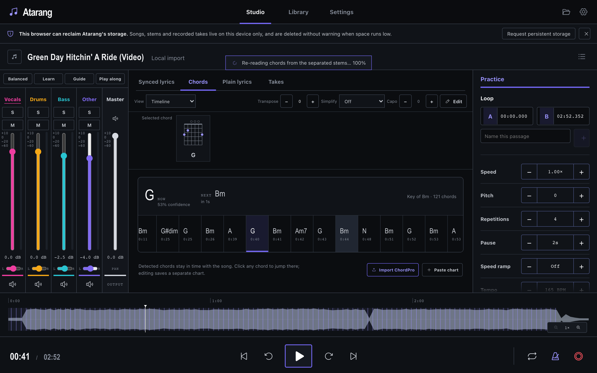
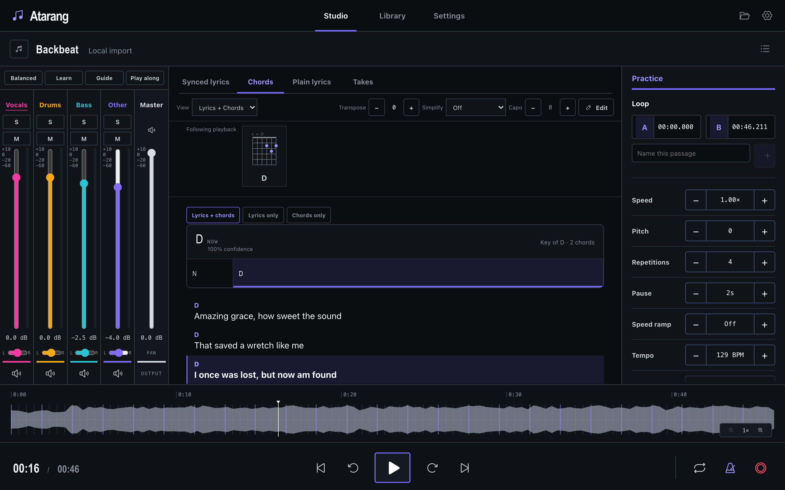
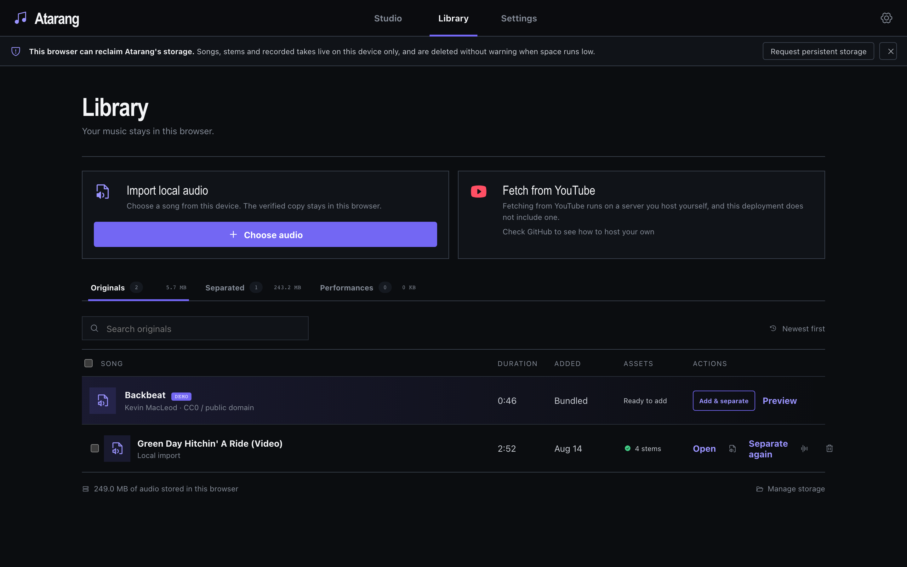
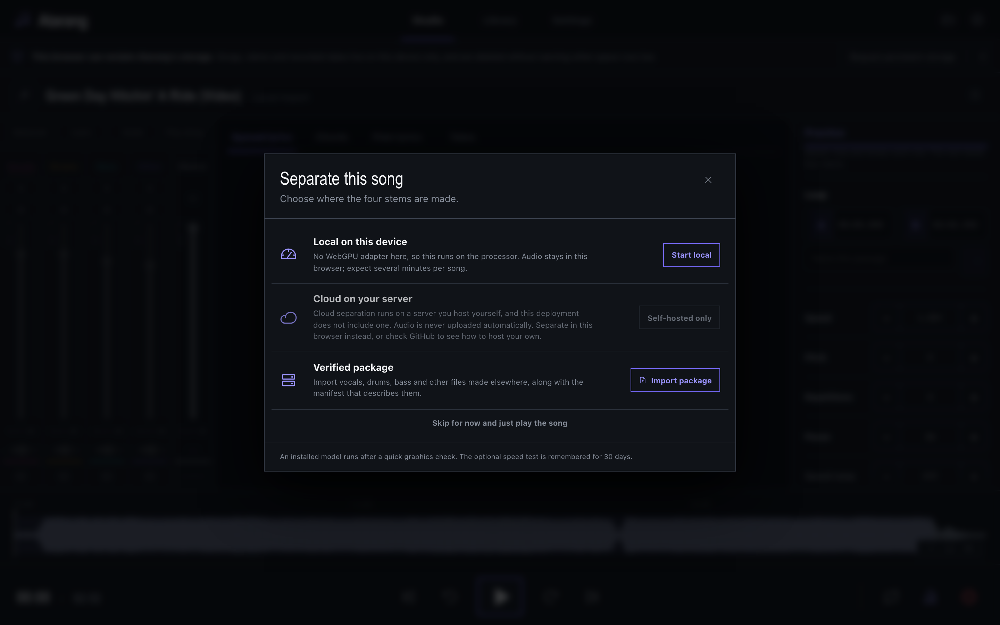
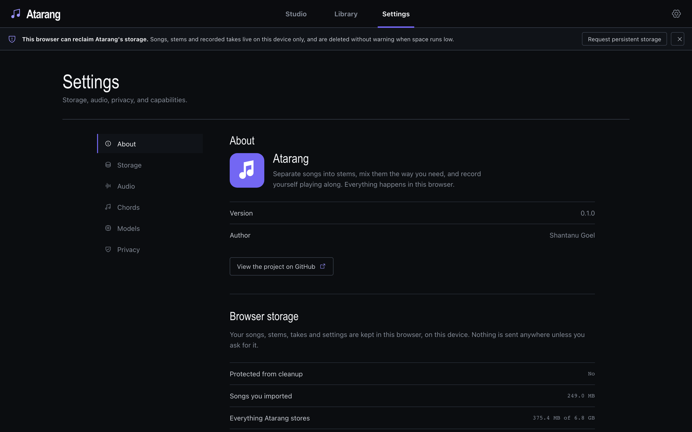

# Atarang

Separate a song into stems, mix them the way you need, and practise against them —
in the browser. Songs, stems, takes and settings stay on your device; nothing is
uploaded unless you ask for it.



## What it does

- **Four-stem separation** — vocals, drums, bass, other. Runs in the browser on a
  checked-in 126 MB model (WebGPU, CPU fallback), on a server you host, or by
  importing stems made elsewhere.
- **Mixer** — per-stem level, pan, solo, mute, master out, and presets (Balanced,
  Learn, Guide, Play along).
- **Practice** — speed and pitch independently, A/B loop with named sections,
  repetitions, pause between reps, speed ramp, tempo, tap tempo, metronome,
  count-in.
- **Chords** — detected with a learned model over the separated stems, with
  current/next chord shapes, transpose, capo, four simplification levels
  (triads, open shapes, power chords), ChordPro import/paste, and your own edits
  saved as a separate chart.
- **Lyrics** — LRCLIB search, LRC import/export, manual writing, synced view, and
  a combined lyrics + chords view that puts each chord over the word it lands on.



- **Recording** — record takes over the mix and keep them in the Library.
- **Library** — local import, per-category storage totals, backup and restore,
  and YouTube fetching when a backend is configured.

| Library | Separation | Settings |
|---|---|---|
|  |  |  |

## Run it locally

```sh
bun install
bun run dev                  # http://localhost:3000, rebuilds on save (reload the tab)
```

`bun run typecheck`, `bun test`, `bun run test:e2e` for the gates. `bun run build`
emits a purely static `apps/web/dist`; `bun run preview` serves it on `:4173`.

Both `dev` and `preview` send the COOP/COEP headers `SharedArrayBuffer` needs.
**Without them, `crossOriginIsolated` is false and separation, four-stem playback,
metronome, count-in and recording all refuse to start.**

## Deploy: frontend only (static)

The build is just files. Everything except cloud separation and YouTube fetching
works with no server at all.

```sh
bun run build                # apps/web/dist
```

`build.ts` writes `dist/_headers` with the cross-origin isolation headers, the CSP
and immutable caching. Any host that reads `_headers` (Cloudflare Pages/Workers,
Netlify) works as-is; on any other host, configure it to send the same headers —
`Cross-Origin-Opener-Policy: same-origin` and `Cross-Origin-Embedder-Policy:
require-corp` are not optional. Serve unmatched paths with `index.html`.

**Cloudflare Workers:** `bun run cfdeploy` stages the model, builds and runs
`wrangler deploy` — no separate download step.
`wrangler.jsonc` declares assets only — no Worker script, because static asset
requests are unmetered while Worker invocations are billed and start answering
429, which here would mean model weights failing to download. It also declares
the custom domains, so the deploy attaches them rather than leaving a manual
dashboard step to remember; change the `routes` patterns for a different domain,
whose zone has to be in the same Cloudflare account.

**Without a backend**, cloud separation and YouTube fetching do not disappear: the
separation sheet, the Library YouTube card and Settings each explain the feature
needs a self-hosted server and link the repository.

## Deploy: frontend + backend

The app is not told whether it has a backend — it finds out by probing
`/api/v1/capabilities` on its own origin and on the address baked into the build,
and taking whichever answers.

1. Point the build at your API (skip this if the API is proxied under the same
   origin, as the Compose deployment does):
   ```sh
   ATARANG_BACKEND_URL=https://api.example.com bun run build
   ```
   It is a hostname, not a secret, and fills both the bundle and the CSP
   `connect-src`. `ATARANG_BACKEND_URL=` (empty) restricts the app to its own
   origin.
2. Stand up the API — see below.
3. In the app, Settings → Cloud processing: paste the deployment key. That is the
   only thing entered by hand; it is a secret, so it is never in the bundle. It
   is kept in `localStorage`, never written into a backup, and "Forget key"
   removes it.

For a cross-origin backend set the API's `ATARANG_PUBLIC_ORIGIN` to the frontend
origin — the page's address, not the API's own — because it is the single origin
CORS allows — and Compose requires `PUBLIC_ORIGIN` rather than defaulting it. A
backend that will not accept this frontend's origin correctly fails the probe.

### The backend (Docker Compose)

Sources live in `services/api`, `services/worker`, `services/acquisition` and
`infra/compose`.

Before building:

1. Generate `uv.lock` with Python 3.12 and uv; require `uv lock --check` in CI.
2. Only if you are running a separation worker (`--profile cpu` or `cuda`): set
   `MODEL_ARTIFACT_SHA256` to the reviewed SHA-256 of the official `htdemucs`
   checkpoint. The worker Dockerfile downloads the pinned checkpoint URL during
   the image build and fails on a mismatch; workers never download it at runtime.
3. `cd infra/compose && ./create-env.sh .env` (or fill `.env` from
   `.env.example` with random secrets — do not commit it). `YOUTUBE_ENABLED=true`
   only for an operator-approved deployment; the acquisition container pins
   yt-dlp, runs Deno with restricted permissions, accepts only normalized YouTube
   video URLs, and has separate egress.
4. Benchmark on the real hardware. CPU is eligible at warm p95 RTF ≤ 1.5; CUDA at
   p95 RTF ≤ 0.5, < 80% VRAM and zero OOM/device resets. Concurrency stays at one.

Start it:

```sh
docker compose -f infra/compose/compose.yaml -f infra/compose/compose.cpu.yaml --profile cpu up -d --build
```

Swap in `compose.cuda.yaml` / `--profile cuda` for GPU. Only Caddy publishes a
host port (`HOST_HTTP_PORT`, default 4173) and it reverse-proxies `/api/*`, so the
same-origin probe succeeds with no `ATARANG_BACKEND_URL` at all; the default
`SITE_ADDRESS=:80` expects TLS termination by an existing reverse proxy. Verify
`/api/v1/health/ready`, `/api/v1/version`, an upload canary, result import and
explicit result purge.

**API only, frontend hosted elsewhere:** set `WEB_BUILD_TARGET=proxy` and drop
the worker overlay. Caddy is then the `/api/*` reverse proxy without the bundle,
and nothing in the deployment needs the separation checkpoint or torch. One
compose file and one variable, so a host with a single compose path — Coolify —
can run it.

```sh
WEB_BUILD_TARGET=proxy PUBLIC_ORIGIN=https://atarang.app docker compose -f infra/compose/compose.yaml up -d --build
```

**ARM hosts** (a Raspberry Pi, an arm64 runner) build as they are: `uv.lock`
resolves for `aarch64` as well as `x86_64`, and the CUDA extra is marked
x86-only because the cu128 index publishes no ARM wheels. Separation is the
caveat rather than the build — htdemucs on a Pi CPU is nowhere near the RTF ≤
1.5 gate below, so run such a host without a worker and leave separation to the
browser.

Run `atarang-cleanup` hourly: incomplete uploads expire after 30 minutes,
failed/cancelled sources within an hour, results after 24 hours. Successful
YouTube acquisitions are content-addressed and kept for reuse; deleting a job
never deletes that cache entry. `infra/backup/backup.sh` backs up PostgreSQL and
resolved configuration, deliberately not the expiring job media — test restore
weekly. Drain workers before rollback, roll back by immutable image digest only,
and never across a destructive migration.
`infra/release/release-images.sh` is the fail-closed promotion path (lock and
checksum checks, web gates, SBOM/provenance, Cosign signing).

> **This is a private, single-operator deployment.** A high-entropy deployment key
> authorizes job creation; per-job capability tokens authorize job access. Public
> multi-user operation would need identity and sessions, per-user job ownership,
> rate limits, abuse controls, consent records, revocation, and a deliberate
> policy for source-cache sharing. Do not expose it as one.

## Browsers

Current and previous stable desktop releases.

| | Chrome / Edge | Firefox | Safari (macOS) |
|---|---|---|---|
| Library, practice, cloud separation | Yes | Yes | Yes |
| Four-stem playback and recording | Yes | Yes (buffer-copy fallback allowed) | Yes |
| Browser separation | After the device probe passes | Only if the WASM probe passes | Hidden |

Mobile layouts support playback and review. Mobile recording and browser
separation are not release promises.

## Notable licenses

MIT unless noted. Vendored Signalsmith Stretch (MIT) carries its notice in
`apps/web/src/vendor/signalsmith-stretch/`; the bundled CREMA chord model is
BSD-2-Clause with its notice in `models/chords/`; the separation weights are
checked in under `model-files/`. Mediabunny is MPL-2.0 and, on the server
side, MinIO is AGPL-3.0 — review both before redistributing an image.

## How the pieces fit

- `apps/web` — the whole client. `build.ts` is the build: it stages the ONNX
  runtime and the chord model content-addressed, bundles the app and each worker
  entry separately, and writes `_headers` and `precache.json`. There is no
  framework CLI in the loop.
- `apps/web/src/features/*` — one directory per surface (studio, library,
  separation, chords, lyrics, recording, settings, analysis). `PlaybackSession`
  sits above the router outlet and owns the song, the audio and the shortcuts, so
  playback survives navigating away from the Studio.
- `apps/web/src/audio` — the four-stem engine and its AudioWorklet processor:
  mixing, looping, speed and pitch, metronome and repetition counting all happen
  on the audio thread, which is why `SharedArrayBuffer` and cross-origin
  isolation are hard requirements.
- `apps/web/src/storage` — IndexedDB for records, OPFS for bytes, plus backup,
  restore, integrity sweeps and the zip writer.
- `apps/web/src/workers` — analysis, inference, I/O and recording, off the UI
  thread.
- `packages/contracts` — the schemas both sides validate against, with the
  assertion helpers used at every trust boundary.
- `services/{api,worker,acquisition}` and `infra/` — the optional backend for
  cloud separation and YouTube fetching, and how it is deployed.

## Contributing

What is worth building next, what is not, and why: `next_steps.md`. After API
contract changes, regenerate the committed OpenAPI snapshot with
`uv run --package atarang-api python services/api/scripts/export_openapi.py`.
There is no CI yet, so the gates above are honour-system: run them before you
push, and a workflow should fail on a regeneration diff once one exists.
